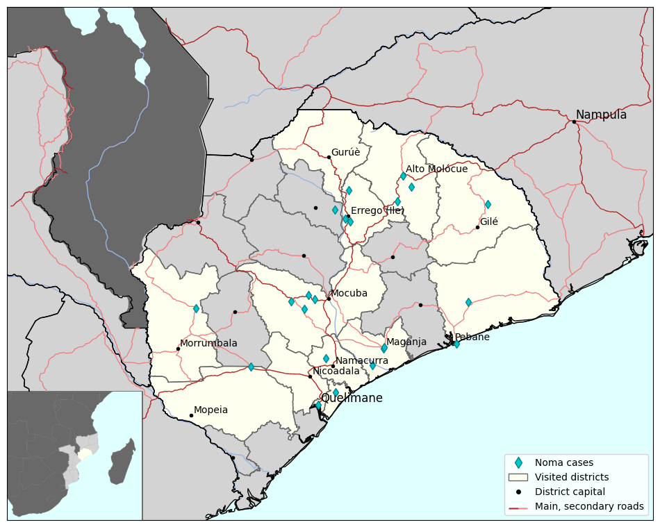

# Code used to generate figure for article [...Pending...]

> Note: example file `Case_series.csv` is not issued from real data (which remains unpublished).

## Data sources

- Mozambique - delimitations and borders:

    Mozambique INE (Instituto Nacional de Estatistica) Census 2007 data from WFP Geonode, cleaned by UN OCHA ROSEA. Maputo City districts added from SALB boundaries by OCHA. 

    https://data.humdata.org/dataset/cod-ab-moz

- Mozambique - Health facilities:

    SIS-MA, Mozambique Ministry of Health and OCHA Mozambique 

    https://data.humdata.org/dataset/mozambique-health-facilities

- Mozambique - Roads, cities and waterways:

    Geofabrik GmbH and OpenStreetMap Contributors
    https://download.geofabrik.de/africa/mozambique-latest-free.shp.zip

- Natural Earth
    Natural Earth was built through a collaboration of many [volunteers](http://www.naturalearthdata.com/about/contributors/) and is supported by [NACIS](http://www.nacis.org/) (North American Cartographic Information Society).
    https://www.naturalearthdata.com/downloads/ Small scale data, 1:110m

## Final result

This is the final generated map, it will be edited in Inkscape to remove frontiers problems etc.

